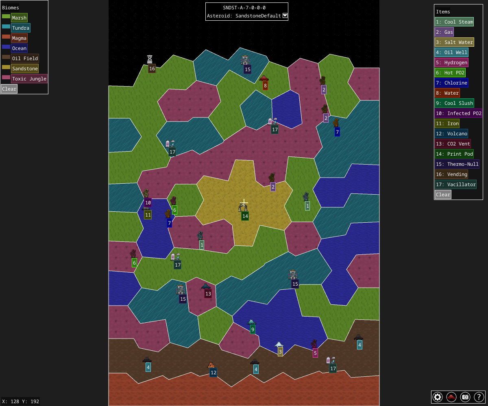

# Oni-SeedView

Oni-SeedView is a small utility for inspecting **Oxygen Not Included** seed data. It downloads seed information from [Maps Not Included](https://mapsnotincluded.org) and displays an interactive map of an asteroid using [Ebiten](https://ebiten.org/). The viewer renders geysers, points of interest and biome boundaries with scaling icons and a small legend. You can pan around and zoom in or out.



## Features

* Fetches seed data in [CBOR](https://en.wikipedia.org/wiki/CBOR) format from the MapsNotIncluded ingest API.
* Converts the data to JSON and optionally saves it to disk with the `-out` flag.
* Smooth panning via arrow keys, **WASD** or by dragging with the mouse.
* Touch controls for panning and pinch-to-zoom on supported devices.
* Mouse wheel and `+`/`-` keys control zoom. The window can be resized at any time.
* Textured biomes with a color legend and icons for geysers and points of interest.
* The empty space around the asteroid now uses a repeating space texture.
* Biome texture mapping is documented in [BIOME_TEXTURES.md](BIOME_TEXTURES.md).
* Supports running in headless environments using `Xvfb`.
* Click the camera icon to capture screenshots. A menu allows
  selecting image quality from low (2K) to high (8K).
* Hover over geyser or POI icons to show an information panel.
  Clicking pins the panel so it stays visible while panning.
* A help icon displays the available controls at any time.
* A `+` icon toggles enlarged UI text for accessibility.
* Crosshairs at the center show the current world coordinates,
  useful for lining up precise screenshots.
* A water-drop icon opens a scrollable list of all geysers
  present on the map.
* Biome and item legend panels scroll when they extend past the window height,
  with extra space so items near the bottom can clear the icons.
* Icons load asynchronously so the map is usable immediately.
* The screen refreshes automatically when the window is restored
  and once a second to prevent blank displays.

## Controls

- **Arrow keys/WASD** – pan the camera.
- **Mouse wheel or `+`/`-`** – zoom in and out.
- **Drag with the mouse** – pan.
- **Pinch gestures** – zoom on touch devices.
- **Camera icon** – open the screenshot menu.
- **Water-drop icon** – show a list of all geysers.
- **Question mark** – display the help overlay.
- **Plus icon** – enlarge the UI (turns to a minus when active).

## Getting Started

1. **Install Go** – Go 1.24 or newer is required to build the program.
2. **Install system packages** – Building with Ebiten needs X11 and OpenGL headers. For cross-compiling Windows binaries `mingw-w64` is also required:

   ```bash
   sudo apt-get install xorg-dev libgl1-mesa-dev mingw-w64
   ```

3. **Build and run** – Execute the program with a seed coordinate. All required
   image assets are embedded so no additional downloads are needed. The window
   defaults to 1280×720 but can be resized.

   ```bash
   go run . -coord SNDST-A-7-0-0-0
   ```

   To save the decoded seed as JSON use the optional `-out` flag:

   ```bash
   go run . -coord SNDST-A-7-0-0-0 -out seed.json
   ```

## Running Headless

If you need to run the viewer on a machine without a display, install `Xvfb` and use the provided script. The script starts a virtual framebuffer so the window can be created.

```bash
sudo apt-get install xvfb   # one-time setup
./scripts/run_headless.sh -coord SNDST-A-7-0-0-0
```

## WebAssembly Build

Run the build script to compile the program and copy the necessary runtime files. The WebAssembly module is optimized and compressed, with the runtime JavaScript and HTML files placed in `dist/`.

```bash
./scripts/build_all.sh
```

Open `dist/index.html` in a browser to enter a seed. The page has a dark themed form with Material icons and now includes an optional field to choose the asteroid ID. Valid seeds redirect to `view.html` which loads `oni-view.wasm.gz` and decompresses it with [Pako](https://github.com/nodeca/pako).
You can also provide the seed in the index page URL with `index.html?coord=<seed>` or `index.html#coord=<seed>` (just `#<seed>` works too) and it will forward you to the viewer automatically. You can still specify the seed coordinate directly in the viewer URL using `view.html?coord=<seed>` or `view.html#coord=<seed>`. Add `asteroid=<id>` to select a different asteroid when a seed contains multiple. When an asteroid ID is provided the viewer shows it next to the seed as `ast: <id>`. If the ID is not valid the viewer displays the coordinates and asteroid ID with `This location does not contain Asteroid ID: <id>`. When asteroids are present it lists them like `Valid IDs: <id1>, <id2>`.

## Desktop vs Web and Mobile

Oni-SeedView runs on the desktop as well as in the browser. Key differences between
the environments are:

* **Desktop** – Launch the program with the `-coord` flag to select a seed.
  Screenshot, help and geyser icons are always visible and you interact using
  the mouse and keyboard.
* **WebAssembly** – No command line flags are available. The viewer reads the
  seed from the page URL using `?coord=` or `#coord=` parameters and an optional
  `asteroid=` ID.
* **Mobile** – When running on a mobile OS or in a mobile browser the toolbar
  icons are hidden. Item details appear when the crosshair is centered over a
  geyser or POI, or a POI is clicked, and you pan or zoom using touch gestures.

## Saving Screenshots

Click the camera icon to open the screenshot menu. Choose a quality level
(2K–8K) and the current view is written to a PNG named after the seed.
After clicking **Save Screenshot** the button briefly shows *Taking Screenshot...*
with a red outline before the menu closes automatically.
You can also generate a screenshot non-interactively:

```bash
go run . -coord SNDST-A-7-0-0-0 -screenshot myshot.png
```

## Repository Layout

```
assets/     # Embedded image files used by the viewer
scripts/    # Helper scripts for building, asset download and headless execution
main.go     # Program entry point and rendering logic
display.go  # Icon selection and drawing helpers
parse.go    # Functions for decoding biome path strings
colors.go   # Color definitions for different biomes
const.go    # Miscellaneous constants and configuration
names.json  # Mapping tables for translating internal IDs to display names
```

Unit tests live alongside the code (`main_test.go`, `zoom_test.go`). Format the
Go files and run the tests with the `test` build tag:

```bash
gofmt -w *.go
go test -tags test ./...
```

## License

The project is released under the MIT License. See [LICENSE](LICENSE) for full details.

## Attribution

Seed information and image assets come from the [Maps Not Included](https://mapsnotincluded.org) project. Their source code repositories can be found on GitHub under [MapsNotIncluded](https://github.com/MapsNotIncluded).

