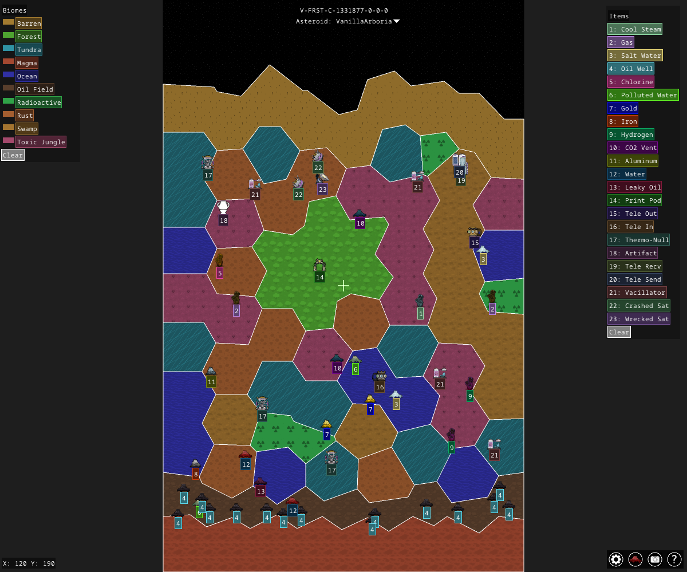

# Oni-SeedView

Oni-SeedView is a small viewer for **Oxygen Not Included** seed data. It fetches information from [Maps Not Included](https://mapsnotincluded.org) and renders an interactive map using the [Ebiten](https://ebiten.org/) game engine.



- ~4.6k lines of Go code
- Engine: Ebiten 2
- Major libraries: `golang.org/x/image`

## Quick Start

1. Install Go 1.24 or newer.
2. Install system packages:

   ```bash
   sudo apt-get install xorg-dev libgl1-mesa-dev mingw-w64
   ```

3. Build and run with a seed coordinate:

   ```bash
   go run . -coord SNDST-A-7-0-0-0
   ```

See [docs/HEADLESS.md](docs/HEADLESS.md) for running without a display and [docs/WEBASSEMBLY.md](docs/WEBASSEMBLY.md) for the web build.

## Controls

- **Arrow keys/WASD** – pan the camera.
- **Mouse wheel or +/-** – zoom in and out.
- **Drag with the mouse/touch** – pan.
- **Pinch with two fingers** – zoom on touch.
- **Click or tap geysers/POIs** – center and show details.
- **Tap legend entries** – highlight items.
- **Camera icon** – open screenshot menu.
- **Geyser-icon** – list all geysers.
- **Question mark** – toggle this help.
- **X button** – close this help.
- **Gear icon** – open options.

Additional help and screenshot instructions live in [docs/HELP.md](docs/HELP.md).

## Features

- Textured biomes with icons for geysers and points of interest.
- Smooth mouse, keyboard and touch input.
- Screenshot capture with quality presets.
- Options menu for toggling textures, Vsync, icon size and more.
- Automatically centers newly loaded asteroids and scales text for any window size.

## Repository Layout

See [layout.md](layout.md) for a detailed overview of how the project is organized.

```
objects/    # Embedded image files
scripts/    # Helper scripts for building and headless execution
html/       # WebAssembly runtime files
main.go     # Program entry point
update.go   # Game update and draw routines
```

More details on texture mapping can be found in [BIOME_TEXTURES.md](BIOME_TEXTURES.md).
See [docs/FONT.md](docs/FONT.md) for font minimization.

## License

Released under the MIT License. See [LICENSE](LICENSE) for details.

## Attribution

Seed information and image assets come from the [Maps Not Included](https://mapsnotincluded.org) project. Their repositories are on GitHub under [MapsNotIncluded](https://github.com/MapsNotIncluded).
